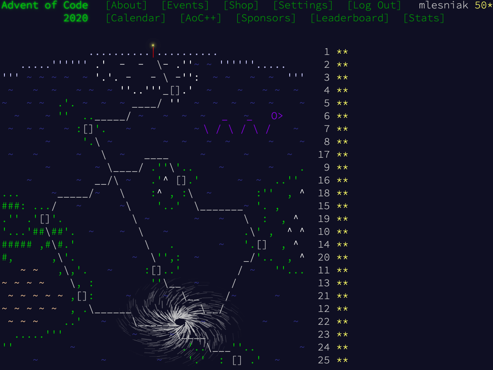
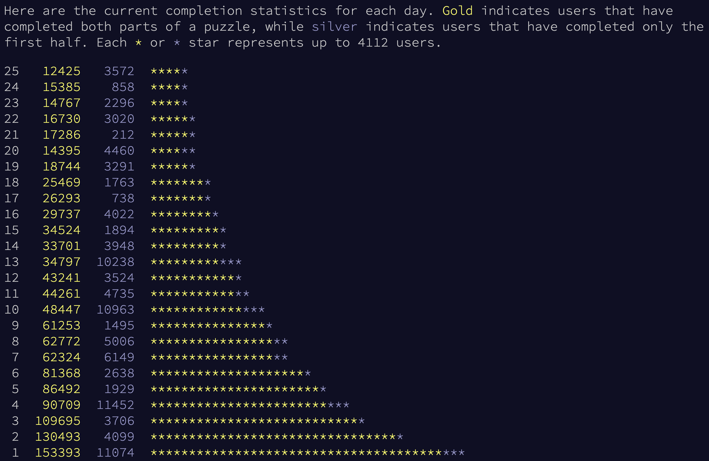

# Overview

My solutions written in Golang, Java and Kotlin for [Advent of Code 2020](https://adventofcode.com/2020).

## Disclaimer

Note that this code is **hacky, not polished or refactored in any way**, i.e. it is probably the worst spaghetti code
you can imagine. Its sole purpose was to solve the puzzles, it should not be used as example for good code.
That means, after I retrieved the correct solution for a puzzle, **I left the source code as it is without any cleanup**. 
Or stated otherwise, **I intentionally gave myself the permission to hack around...**

| Day | Problem                                                         | Topic                                                                                                                       |
|-----|-----------------------------------------------------------------|-----------------------------------------------------------------------------------------------------------------------------|
| 1   | [Report Repair](https://adventofcode.com/2020/day/1)            | Simple equation solving                                                                                                     |
| 2   | [Password Philosophy](https://adventofcode.com/2020/day/2)      | Implement validation parser                                                                                                 |
| 3   | [Toboggan Trajectory](https://adventofcode.com/2020/day/3)      | Geometrical analysis on an infinite grid                                                                                    |
| 4   | [Passport Processing](https://adventofcode.com/2020/day/4)      | Solve logic puzzle with interdependent variables                                                                            |
| 5   | [Binary Boarding](https://adventofcode.com/2020/day/5)          | Solve a SAT-based problem                                                                                                   |
| 6   | [Custom Customs](https://adventofcode.com/2020/day/6)           | Interdependent boolean expressions                                                                                          |
| 7   | [Handy Haversacks](https://adventofcode.com/2020/day/7)         | Parse and compute recursive expressions                                                                                     |
| 8   | [Handheld Halting](https://adventofcode.com/2020/day/8)         | Simulate simple CPU with self-modifying code                                                                                |
| 9   | [Encoding Error](https://adventofcode.com/2020/day/9)           | Numeric puzzle with large number of inputs                                                                                  |
| 10  | [Adapter Array](https://adventofcode.com/2020/day/10)           | Computing and processing large number of permutations                                                                       |
| 11  | [Seating System](https://adventofcode.com/2020/day/11)          | Mixture of cellular automata and general 2D geometry                                                                        |
| 12  | [Rain Risk](https://adventofcode.com/2020/day/12)               | Simulate ship movements and relative computations                                                                           |
| 13  | [Shuttle Search](https://adventofcode.com/2020/day/13)          | Number theory (chinese remainder formula)                                                                                   |
| 14  | [Docking Data](https://adventofcode.com/2020/day/14)            | Bitwise binary computations                                                                                                 |
| 15  | [Rambunctious Recitation](https://adventofcode.com/2020/day/15) | Game simulation with intelligent caching                                                                                    |
| 16  | [Ticket Translation](https://adventofcode.com/2020/day/16)      | Set-based combinatorial puzzle solving                                                                                      |
| 17  | [Conway Cubes](https://adventofcode.com/2020/day/17)            | Simulating a 3D conway cube                                                                                                 |
| 18  | [Operation Order](https://adventofcode.com/2020/day/18)         | Parsing mathematical expressions                                                                                            |
| 19  | [Monster Messages](https://adventofcode.com/2020/day/19)        | Parsing a BNF grammar                                                                                                       |
| 20  | [Jurassic Jigsaw](https://adventofcode.com/2020/day/20)         | Tile matching of a split and randomized image. This was probably one of the most difficult puzzles I've ever solved in AOC. |
| 21  | [Allergen Assessment](https://adventofcode.com/2020/day/21)     | Breadth-First solver for pattern matching                                                                                   |
| 22  | [Crab Combat](https://adventofcode.com/2020/day/22)             | Modulo-based array arithmetic                                                                                               |
| 23  | [Crab Cups](https://adventofcode.com/2020/day/23)               | Circular linked list operations                                                                                             |
| 24  | [Lobby Layout](https://adventofcode.com/2020/day/24)            | Cellular automata in a hexagonal grid                                                                                       |
| 25  | [Combo Breaker](https://adventofcode.com/2020/day/24)           | Public key cryptography                                                                                                     |                                                                                            |   |                                                                                              |   |

